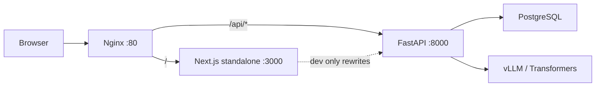
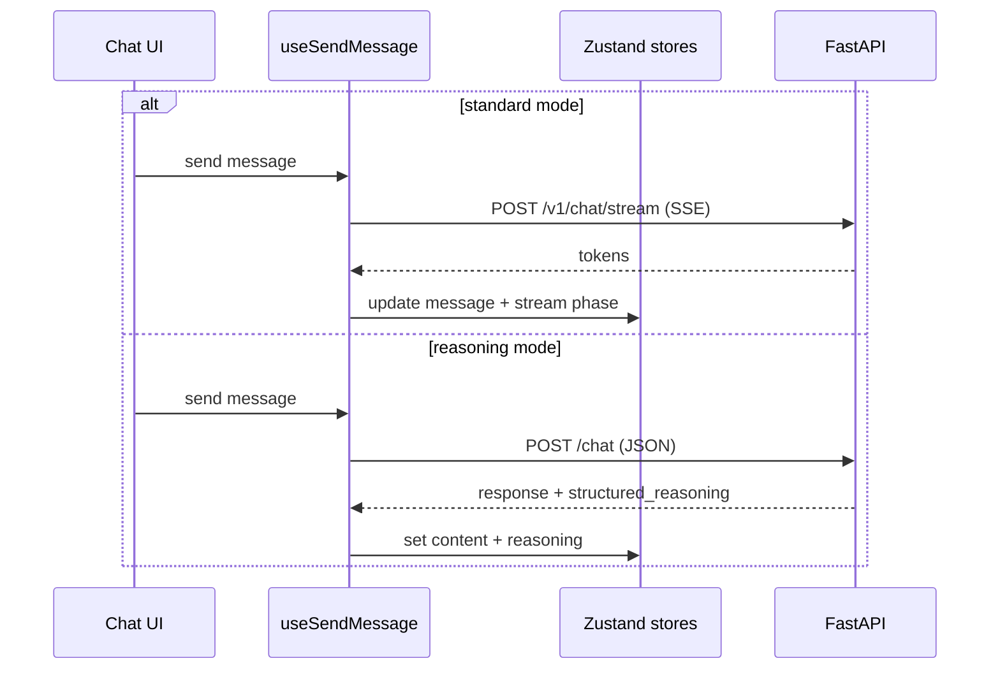
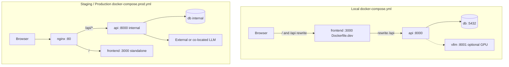

# Architecture

This document describes the full-stack architecture of the **Anti-Sycophancy Reasoning Engine** — a system that runs multi-stage LLM analysis before generating responses, exposes specialized analysis agents over HTTP, and ships a production-ready Next.js client with streaming chat, structured reasoning UI, and offline-first local persistence.

The codebase is organized as a **monorepo** with two primary applications:

| Application | Path | Role |
|-------------|------|------|
| Backend API | `backend/` | FastAPI service: chat, streaming, reasoning pipeline, analysis agents, memory, training tooling |
| Frontend | `frontend/` | Next.js 15 client: chat UI, dashboard, auth screens, landing page |

Deeper documentation lives in dedicated files so each layer can be read independently:

- **[Backend architecture](backend/ARCHITECTURE.md)** — Python services, domain model, API routes, LLM adapters, database, training pipelines
- **[Frontend architecture](frontend/ARCHITECTURE.md)** — App Router, feature modules, Zustand stores, API client, streaming, production Docker/nginx

---

## System overview

At runtime, a typical user session flows through three tiers. In **development**, the Next.js dev server proxies `/api` to FastAPI. In **production**, nginx terminates HTTP on port 80, routes `/api/` to the backend container, and forwards all other traffic to the Next.js standalone server.



The frontend never talks to the LLM directly. All inference happens on the backend through a **ModelManager** that selects among vLLM server, local vLLM, or Hugging Face Transformers based on environment configuration.

---

## Design principles (full stack)

These principles apply across both applications and explain why the repository is structured the way it is.

**Dependency rule (backend).** Inner layers — domain types and business rules — never import FastAPI, SQLAlchemy, or vLLM. HTTP routers translate requests into service calls; services orchestrate domain logic and call outward through ports (LLM provider, repositories). This keeps analyzers testable with mocked models and makes it possible to swap infrastructure without rewriting business logic.

**Feature-first vertical slices (frontend).** Domain UI and behavior live in `frontend/src/features/` (chat, auth, dashboard, etc.), not in a flat `components/` tree. The App Router under `app/` is a thin routing shell that composes feature exports. Shared primitives (`components/ui`, `hooks`, `utils`) stay domain-agnostic and must not import from features.

**Two-tier API client (frontend).** Low-level HTTP transport (`lib/api/`: Axios, interceptors, SSE, token refresh, retry) is separated from domain services (`services/api/`: chat, health, auth, feedback). Components and hooks call `@/services`, never raw `fetch()`, so transport concerns stay centralized.

**Configuration over code.** LLM backend, database URL, log format, classifier mode, CORS origins, and frontend API URLs are all driven by environment variables. Production Docker Compose (`docker-compose.prod.yml`) wires these for containerized deployment.

**Composition over inheritance.** Orchestrators such as `ChatPipeline`, `DebateEngine`, and `EvalPipeline` compose injected collaborators rather than extending deep class hierarchies. FastAPI `Depends()` in `api/deps.py` is the HTTP composition root; training CLI scripts accept injectable settings and registries.

---

## Chat modes and dual request paths

The product exposes two chat experiences that map to **different backend endpoints** and **different frontend code paths**.

### Standard mode (streaming)

Standard mode is optimized for conversational UX. The user sends a message; the assistant reply arrives token-by-token over **Server-Sent Events (SSE)**.

1. Frontend: `useSendMessage` → `streamChatWithRetry` (`services/api/stream-chat.service.ts`)
2. Transport: `openSseStream` / `readSseStream` (`lib/api/streaming.ts`) with auth headers, abort support, and exponential backoff
3. Backend: `POST /api/v1/chat/stream` → `ChatService.stream_message()` → `ModelManager.generate_stream()`
4. State: `useStreamingStore` tracks stream phase; `useConversationStore` appends tokens to the assistant message

SSE responses use JSON lines shaped as `{ conversation_id, token, done }`. Nginx is configured with `proxy_buffering off` and long read timeouts so streams are not buffered or cut off.

### Reasoning mode (structured pipeline)

Reasoning mode runs the full analysis pipeline before returning a single JSON response with **structured reasoning** (facts, assumptions, evidence, unknowns, confidence) suitable for the reasoning panel UI.

1. Frontend: `useSendMessage` → `sendPipelineMessage` → `POST /api/chat`
2. Backend: `ChatPipeline.run()` — classify, extract claims, detect assumptions/fallacies, score confidence, build structured reasoning
3. State: `useConversationStore.setStructuredReasoning()`; `useReasoningPanelStore.setLastConfidence()`

Reasoning mode does not stream today; the UI shows a connecting state and then renders the full response plus the collapsible structured reasoning panel.



---

## Backend summary

The backend follows **clean architecture** with packages under `backend/src/app/`:

| Layer | Responsibility |
|-------|----------------|
| `api/` | FastAPI routers, request/response DTOs, dependency injection |
| `services/` | Use cases: chat, pipeline, debate, classification, claims, memory, … |
| `domain/` | Plain dataclass business types and port protocols |
| `models/` | LLM inference adapters (vLLM, Transformers) |
| `database/` | SQLAlchemy ORM, async sessions, repositories |
| `prompts/` | Versioned Jinja2 templates per agent |
| `training/` | Offline SFT dataset generation and benchmark evaluation |
| `schemas/` | Pydantic API models (separate from domain and ORM) |

**API surface** (prefix `/api` by default):

- `POST /chat` — full reasoning pipeline (`ChatPipeline`)
- `GET /health`, `GET /ready` — liveness/readiness
- `POST /v1/chat/` — standard non-streaming chat
- `POST /v1/chat/stream` — SSE streaming chat
- `POST /v1/classify`, `/claims/extract`, `/assumptions/detect`, `/fallacies/detect`, `/debate/run`, `/confidence/score`, `/memory/*`, `/contradictions/*` — analysis agents

Every LLM-backed analyzer follows the same module pattern: domain types → engine/detector → JSON parser → versioned prompt template → thin v1 router. See [backend/ARCHITECTURE.md](backend/ARCHITECTURE.md) for stage-by-stage pipeline documentation, repository mapping, and known stubs.

---

## Frontend summary

The frontend is a **Next.js 15 App Router** application with **React 19**, **TypeScript**, **Tailwind CSS**, **shadcn/ui**, **Zustand**, and **TanStack Query**.

**Route structure:**

- `/` — landing page (`features/landing`)
- `/login`, `/signup`, `/forgot-password`, `/reset-password`, `/verify-otp` — auth flows (`features/auth`)
- `/(dashboard)/chat`, `/c/[id]`, `/profile`, `/settings` — authenticated shell (`features/dashboard` + `features/chat`)
- `/health` — frontend health probe for Docker/load balancers

**Client state** is split across eight Zustand stores (plus a deprecated `useUserStore` facade):

| Store | Concern |
|-------|---------|
| `useAuthStore` | Session, profile, login/logout |
| `useSettingsStore` | User preferences (streaming, confidence badges, notifications) |
| `useThemeStore` | Theme preference synced with next-themes |
| `useConversationStore` | Conversations, messages, structured reasoning (persisted) |
| `useChatStore` | UI-only: chat mode, sidebar open state |
| `useReasoningPanelStore` | Panel expand/collapse, confidence display |
| `useStreamingStore` | Active stream, message stream phases (ephemeral) |
| `useFeedbackStore` | Per-message helpful/unhelpful/report (persisted) |

**Shared UX primitives** live in `components/feedback/` (skeletons, error pages, offline banner, retry buttons) — distinct from **message feedback** in `features/feedback/` (thumbs up/down on assistant replies).

See [frontend/ARCHITECTURE.md](frontend/ARCHITECTURE.md) for the full dependency graph, code-splitting strategy, and production build/nginx caching behavior.

---

## Monorepo structure (structure map)

```
anti-sycophancy-ai-chatbot/
├── backend/                         # FastAPI application + offline training CLIs
│   ├── src/app/                     # Import package `app` (PYTHONPATH=src)
│   │   ├── api/                     # Routers + deps composition root
│   │   ├── services/                # Use cases / engines / parsers
│   │   ├── domain/                  # Pure business types & ports
│   │   ├── models/                  # LLM adapters (vLLM, Transformers)
│   │   ├── database/                # ORM, sessions, repositories
│   │   ├── prompts/                 # PromptManager + prompts.yml
│   │   ├── memory/                  # Conversation context helpers
│   │   ├── training/                # SFT + eval (offline)
│   │   ├── schemas/                 # Pydantic HTTP DTOs
│   │   ├── config/                  # Settings
│   │   ├── logging/                 # Structured logging
│   │   └── core/                    # Lifespan, security, middleware
│   ├── alembic/                     # Migrations (schema source of truth for Postgres)
│   ├── scripts/                     # generate_sft_dataset, run_eval, export_sft_from_db
│   ├── tests/
│   ├── Dockerfile
│   ├── README.md
│   └── ARCHITECTURE.md
├── frontend/                        # Next.js 15 App Router client
│   ├── src/app/                     # Routes, layouts, error boundaries only
│   ├── src/features/                # Vertical slices (chat, auth, dashboard, …)
│   ├── src/components/              # Shared ui / layout / feedback / motion
│   ├── src/services/api/            # Domain HTTP functions
│   ├── src/lib/api/                 # Axios, SSE, auth refresh, retry
│   ├── src/stores/                  # Zustand
│   ├── nginx/                       # Prod reverse-proxy templates
│   ├── Dockerfile / Dockerfile.dev / Dockerfile.nginx
│   ├── README.md
│   └── ARCHITECTURE.md
├── docker-compose.yml               # Local / developer topology
├── docker-compose.prod.yml          # Staging + production topology
├── .env.example
├── README.md                        # Setup & ops runbook
└── ARCHITECTURE.md                  # This file
```

**Boundary rules**

| From | May depend on | Must not depend on |
|------|---------------|--------------------|
| Backend `domain/` | stdlib / typing | FastAPI, SQLAlchemy, vLLM |
| Backend `services/` | domain, ports, prompts | HTTP routers |
| Backend `api/` | services, schemas, deps | frontend |
| Frontend `features/` | shared `components`, `services`, `stores` | other features’ internals |
| Frontend `app/` | feature public exports | raw Axios / business rules |

---

## Infrastructure and deployment

Environments share the **same images and Compose mental model**, differing mainly by secrets, hostnames, TLS, and whether nginx sits in front.

| Environment | Compose file | Public entry | API routing | Logging | Persistence |
|-------------|--------------|--------------|-------------|---------|-------------|
| **Local (Docker)** | `docker-compose.yml` | `:3000` frontend, `:8000` API | Next.js rewrites (`USE_NEXT_REWRITES=true`) | `LOG_FORMAT=text` | named volume `pgdata` |
| **Local (hybrid)** | `db` only (+ host processes) | host ports | Next rewrites → `localhost:8000` | text | Docker or host Postgres |
| **Staging** | `docker-compose.prod.yml` | nginx `:80` (+ optional TLS terminator) | nginx `/api/` → api | `LOG_FORMAT=json` | dedicated volume / DB |
| **Production** | `docker-compose.prod.yml` | nginx (+ TLS) | nginx `/api/` → api | JSON, `DEBUG=false` | backed-up volume / managed Postgres |



### Development (`docker-compose.yml`)

Development Compose runs:

| Service | Image / build | Notes |
|---------|---------------|-------|
| `db` | `postgres:16-alpine` | User/password/db `postgres`/`postgres`/`chatbot`; healthcheck `pg_isready` |
| `vllm` | `vllm/vllm-openai:latest` | **GPU required**; omit if `nvidia-container-cli` reports no adapters |
| `api` | `backend/Dockerfile` | Mounts `./backend/src`; waits for healthy `db` |
| `frontend` | `frontend/Dockerfile.dev` | Mounts `./frontend/src`; `USE_NEXT_REWRITES=true` |

Recommended no-GPU command: `docker compose up --build db api frontend`.

### Staging (same file as production)

Staging is an **instance** of `docker-compose.prod.yml` with:

- Distinct `POSTGRES_PASSWORD`, hostname (`NGINX_SERVER_NAME`), and `CORS_ORIGINS`
- `NEXT_PUBLIC_SITE_URL` / `NEXT_PUBLIC_API_URL` pointing at the staging origin
- Optional smaller model or shared inference URL via `VLLM_BASE_URL`
- Migrations: `docker compose -f docker-compose.prod.yml exec api alembic upgrade head`
- Prefer synthetic data; still take volume backups before schema experiments

Staging should validate SSE through nginx (`proxy_buffering off`) before production promotion.

### Production (`docker-compose.prod.yml`)

Production Compose runs four services:

1. **db** — PostgreSQL 16 with persistent volume; **`POSTGRES_PASSWORD` required**
2. **api** — backend image; internal port 8000; JSON logging; health check on `/health`
3. **frontend** — multi-stage standalone Next.js build; internal port 3000; `USE_NEXT_REWRITES=false`
4. **nginx** — public port `${NGINX_HTTP_PORT:-80}`; reverse proxy, gzip, static asset caching, SSE-friendly API proxy

Build-time frontend variables (`NEXT_PUBLIC_CLIENT_API_URL=/api`, `NEXT_PUBLIC_SITE_URL`, etc.) are passed as Docker **build args**. Changing them requires an image rebuild. Runtime server variables (`API_URL=http://api:8000/api`) stay inside the container network.

Nginx routing (see `frontend/nginx/templates/default.conf.template`):

- `/api/` → FastAPI (no cache, buffering disabled for SSE)
- `/_next/static/` → cached 365 days (immutable)
- `/_next/image` → image optimization cache
- `/` → Next.js (no HTML cache)

**Database lifecycle in deployed environments**

1. Start stack (`up --build -d`) so `db` becomes healthy  
2. Run `alembic upgrade head` inside `api`  
3. Confirm `/api/ready`  
4. Schedule `pg_dump` backups of the `pgdata` volume / managed instance  

Prod Compose does not publish Postgres ports; administer via `exec` into `db` or a bastion.

**Inference in staging/prod**

`docker-compose.prod.yml` does not define `vllm`. Operators either:

- Run vLLM on a GPU node and set `VLLM_BASE_URL`, or  
- Point `VLLM_BASE_URL` at a managed OpenAI-compatible endpoint  

See root [README.md](README.md) for step-by-step local, staging, and production runbooks.

---

## Cross-cutting concerns

### Authentication (current state)

Backend auth in `core/security.py` is a **placeholder**: when `AUTH_ENABLED=false`, all requests receive an anonymous user. The frontend already has auth UI, `useAuthStore`, token storage (`lib/api/auth-token-store.ts`), and refresh-token wiring — but production JWT/OAuth endpoints are not yet implemented on the backend. Client-side auth state persists locally for profile and settings UX.

### Persistence (current state)

Chat history on the backend uses **`InMemoryStore`** for development; PostgreSQL ORM models and Alembic migrations exist for conversations and memory, but the chat pipeline’s `load_context` stage and standard chat service are not fully wired to PostgreSQL yet. On the frontend, conversations persist to **localStorage** via Zustand `persist` middleware with legacy key migration from the original monolithic chat store.

### Feedback (current state)

The frontend `features/feedback` module and `POST /v1/feedback/` service call are implemented with graceful degradation when the backend route is absent. Message-level feedback is stored in `useFeedbackStore` locally.

### Observability

Backend services use structured logging (`logging/setup.py`): JSON in production, plain text in development. Frontend health is exposed at `GET /health` (Next.js route) and probed by Docker health checks.

---

## Environment configuration

Application-wide variables are documented in [`.env.example`](.env.example). Frontend-specific variables are in [`frontend/.env.example`](frontend/.env.example) and [`frontend/.env.production.example`](frontend/.env.production.example).

| Variable | Layer | Purpose |
|----------|-------|---------|
| `DATABASE_URL` | Backend | PostgreSQL async connection string |
| `MODEL_NAME`, `LLM_BACKEND`, `VLLM_BASE_URL` | Backend | Model selection and inference backend |
| `NEXT_PUBLIC_CLIENT_API_URL` | Frontend | Browser API base (`/api` in production) |
| `API_URL` | Frontend (server) | Internal backend URL for optional rewrites |
| `POSTGRES_PASSWORD` | Infra | Required for production Compose |

Training pipelines use the `TRAINING_` prefix (see `backend/src/app/config/training.py`).

---

## Testing

The backend includes **235+ tests** in `backend/tests/` covering parsers, engines, API routes, pipelines, SFT generation, and evaluation metrics. Tests use `AsyncMock` model managers with fixture JSON for deterministic behavior.

```bash
cd backend
PYTHONPATH=src python -m pytest tests/ -q
```

Frontend quality gates: `npm run typecheck`, `npm run lint`, `npm run build` (standalone output verified in CI/local).

---

## Known gaps and roadmap

These items are intentional stubs or planned work documented here so architects and contributors share the same mental model:

1. **Chat pipeline context** — `ChatPipeline.load_context` does not yet load history from PostgreSQL; it returns empty history.
2. **Chat pipeline inference** — `run_inference` and `build_prompt` are partially stubbed; full ModelManager integration is in progress.
3. **Backend auth** — placeholder only; frontend auth UI is ahead of server implementation.
4. **Chat persistence** — backend in-memory store vs frontend localStorage; PostgreSQL wiring incomplete for live chat.
5. **Rate limiting** — configured in settings but not enforced in middleware.
6. **Feedback API** — frontend ready; backend route not yet implemented.
7. **Fact Checker debate stage** — returns plain text unlike other structured JSON agents.

---

## Related documentation

| Document | Contents |
|----------|----------|
| [README.md](README.md) | Local / staging / production setup, database, LLM options, troubleshooting |
| [backend/README.md](backend/README.md) | Backend setup, migrations, Docker |
| [frontend/README.md](frontend/README.md) | Frontend setup, env matrix, nginx deploy |
| [backend/ARCHITECTURE.md](backend/ARCHITECTURE.md) | Backend layers, API catalog, pipeline stages, DI, training |
| [frontend/ARCHITECTURE.md](frontend/ARCHITECTURE.md) | Feature modules, stores, streaming, Docker, nginx, loading UX |
